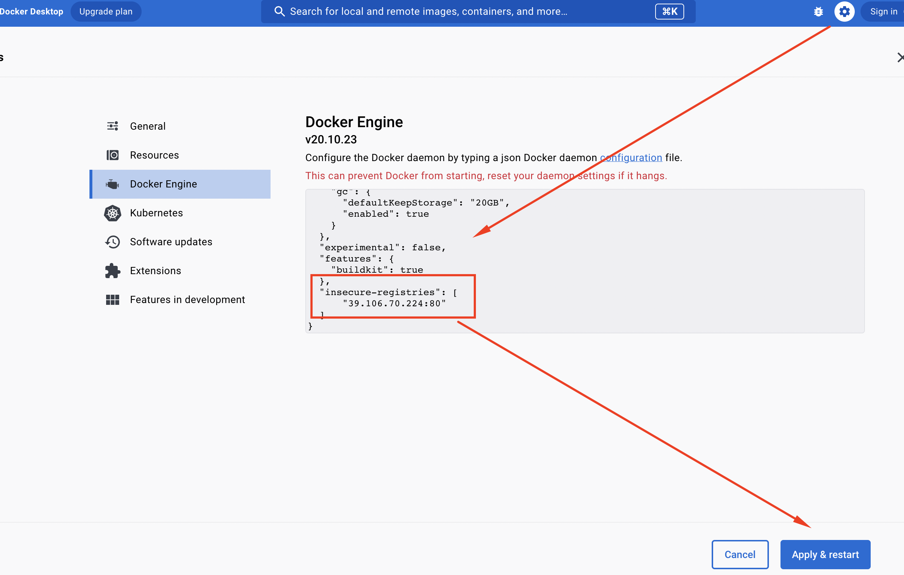
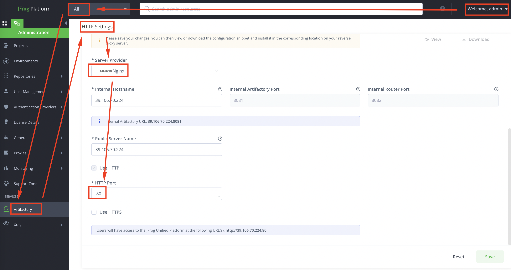
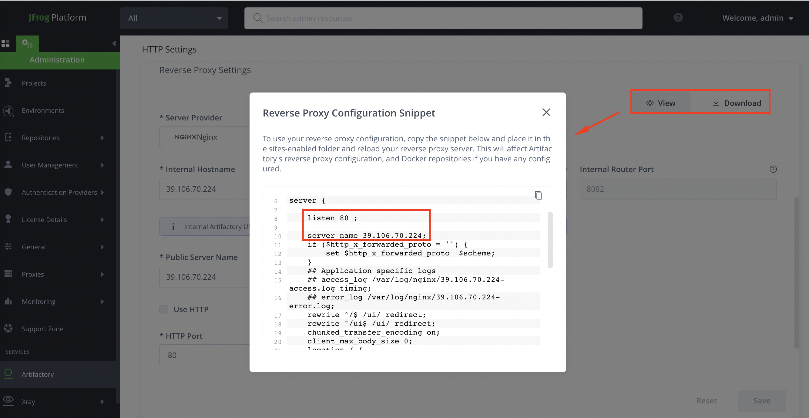
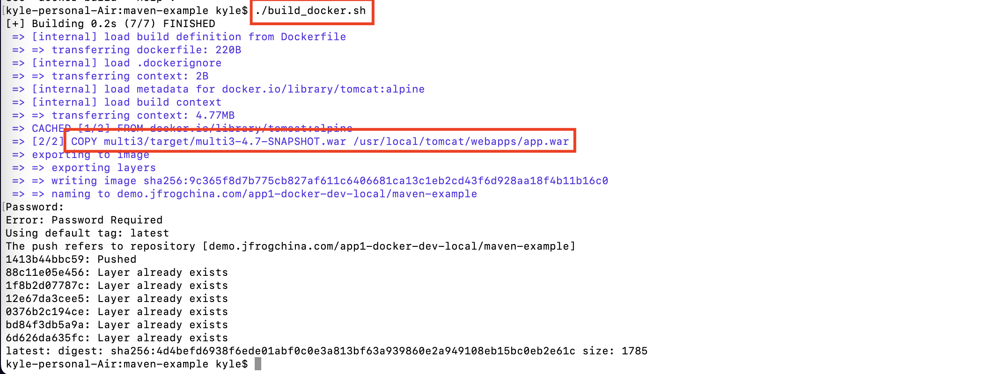

# workshop guide

## maven build & scan demo

- 描述

        1. 小张（制品库管理）
        从 0 开始创建 Artifactory 仓库，配置 Xray 索引

        2. 小王（开发）
        使用 JFrog CLI 构建 maven 项目，将构建产物上传到 Artifactory，查看 Xray 扫描出的漏洞，如 log4j

        3. 小李（开发）
        使用 JFrog CLI 对本地 war 包进行 Xray 扫描

        4. 小赵（安全管理）
        配置 Xray 的监控策略，阻止漏洞组件的下载使用

- 准备

        1. artifactory 账号
        
                e.g.
                jfrog artifactory URL = http://x.x.x.x:8082
                username/password = admin/xxxxxx
                api key = xxxxxx

        2. 构建环境
        
                - 选择1，直接安装以下工具
                
                        - jfrog cli
                        https://www.jfrog.com/confluence/display/CLI/JFrog+CLI

                        - java
                        - maven
                        - wget
                        - unzip

                - 选择2，使用提供的已经安装以上工具的 docker 镜像

                        centos-jfrog-amd64.tar
                        centos-jfrog-arm64.tar
                        ...
                        
        3. maven 项目

                提供的 maven-example.zip
                此项目包含 log4j 等漏洞组件，也可以从 github 下载 https://github.com/kyle11235/maven-example/

- 开始

        1. 从 0 开始创建 Artifactory 仓库，配置 Xray 索引

                e.g.
                app1-maven-central-remote

                app1-maven-snapshot-local
                app1-maven-release-local

                app1-maven-snapshot-virtual
                app1-maven-release-virtual

                app1-docker-dev-local

        
2. 使用 JFrog CLI 构建 maven 项目，将构建产物上传到 Artifactory，查看 Xray 扫描出的漏洞，如 log4j

        - 如果你使用提供的 docker 镜像作为构建环境，先导入镜像
        
                docker load < centos-jfrog-amd64.tar
                docker load < centos-jfrog-arm64.tar

        - 运行
        
                进入到 maven-example.zip 所在目录下，以下命令会挂载当前目录，使你在 docker 容器中能够访问到 maven-example.zip
                选择适合你电脑型号的镜像

                docker run -it --name centos-jfrog-arm64 -v $(pwd):/root centos:jfrog-amd64 bash
                docker run -it --name centos-jfrog-arm64 -v $(pwd):/root centos:jfrog-arm64 bash

                启动后可以做一些检查
                cd ~
                ls
                jf -v
                java -version
                mvn -v

        - configure jfrog cli
        
                jf c add

                e.g.
                server ID = art-china (please use this ID for later maven demo)

        - 进入 maven 项目目录
        
                cd ~
                unzip maven-example.zip
                cd maven-example

        - 修改 maven.yaml

                vi .jfrog/projects/maven.yaml

                serverId: art-china 对应之前配置 jfrog cli 的 serverId
                
                仓库名称，请更改为你自己的, e.g.
                team1-maven-snapshot-virtual
                team1-maven-release-virtual

        - build & deploy to artifactory
        
                ./cli_maven_build.sh

        - 查看上传的制品和扫描的漏洞

3. 使用 JFrog CLI 对本地 war 包进行 Xray 扫描

         jf s multi3/target/multi3-4.7-SNAPSHOT.war

4. 配置 Xray 的监控策略，阻止漏洞组件的下载使用

        - 创建 policy

        - 设置 rule 的规则如果包含高危漏洞组件，则下载

        - 创建 policy, rule, watch，为 watch 选中所有仓库和 rule

        - 为仓库中已有的制品点击扫描生成违反警告

        - 再次查看仓库中制品，尝试下载，发现已被阻止

## docker build & scan demo（此部分无需动手实验，仅供了解）

        - 在你的开发环境，为了访问未开启 https 的镜像仓库，做以下更改，重启 docker

                也可以通过命名更改这个配置
                
                vi /etc/docker/daemon.json

                {
                "insecure-registries": [
                "39.106.70.224:80"
                ]
                }

        - 在 artifactory 服务器端配置 nginx 代理 artifactory，nginx 配置可以在 artifactory 中生成

        - 构建 docker 镜像
        
                完成上一个 maven 构建的实验后，从构建容器环境中退出，来到 maven-example 目录下
                更改 build_docker.sh 中的用户名和 docker 仓库名称

                开始构建，输入你的密码登录
                ./build_docker.sh

                在 artifacotry docker 镜像仓库中查看被上传的镜像

                对于 docker 镜像，Xray 可对其进行深度扫描，并让你知道漏洞所在的具体层级

