# workshop guide

## 实验 1 - maven build & scan demo

- 描述

        1. 开发者在JFrog Artifactory配置仓库进行构建。
        2. 开发者进行maven构建，通过Artifactory进行依赖下载。
        3. 开发者将构建包上传到Artifactory，并进行漏洞扫描。
        4. 开发者将构建的jar包放入docker镜像并构建镜像。
        5. 扫描docker镜像，配置漏洞扫描策略，阻止超高危漏洞的下载。

- 准备

        1. artifactory 账号
        
                e.g.
                jfrog artifactory URL = http://39.106.70.224:8082
                username/password = team1/xxxxxx, team2/xxxxxx ...

                以上由现场工作人员提供

        2. 实验材料
        
                - 选择1，登录 artifactory
                
                        http://39.106.70.224:8082/artifactory/app1-generic-dev-local/

                        访问 app1-generic-dev-local 仓库，可以从中下载本次实验材料，按需下载，节省时间

        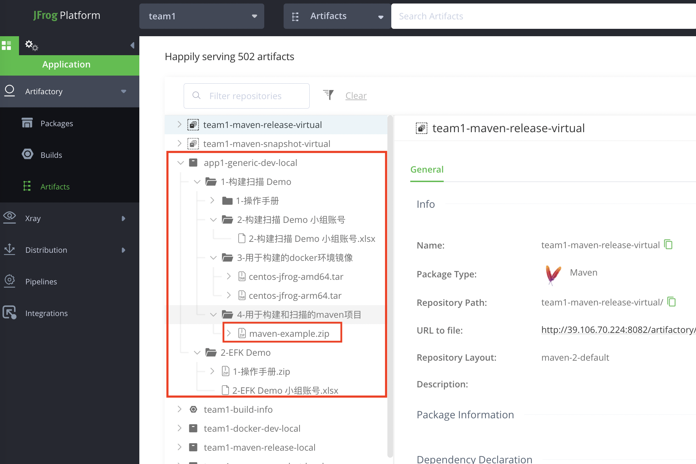

                - 选择2，如果现场人员提供了 USB，也可以从中拷贝以上材料

        3. 构建环境

                - 选择1，如果你的电脑上装有 docker，可以从以上实验材料中获得 docker 镜像的导出包，其中已经安装 jfrog cli, java, maven, unzip 这些工具

                        centos-jfrog-amd64.tar (适合一般电脑使用)
                        centos-jfrog-arm64.tar (适合 arm 架构电脑使用，例如 mac m1, m2)
                        ...

        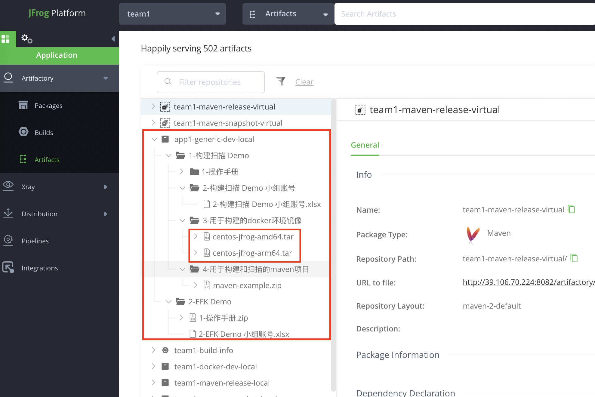

                - 选择2，也可以在电脑上直接安装以下工具
                
                        - jfrog cli
                        
                                请按以下链接中指引操作，支持 mac, linux, windows
                                https://www.jfrog.com/confluence/display/CLI/JFrog+CLI

                        - java

                                - 通过安装包安装
                                https://www.oracle.com/java/technologies/downloads/

        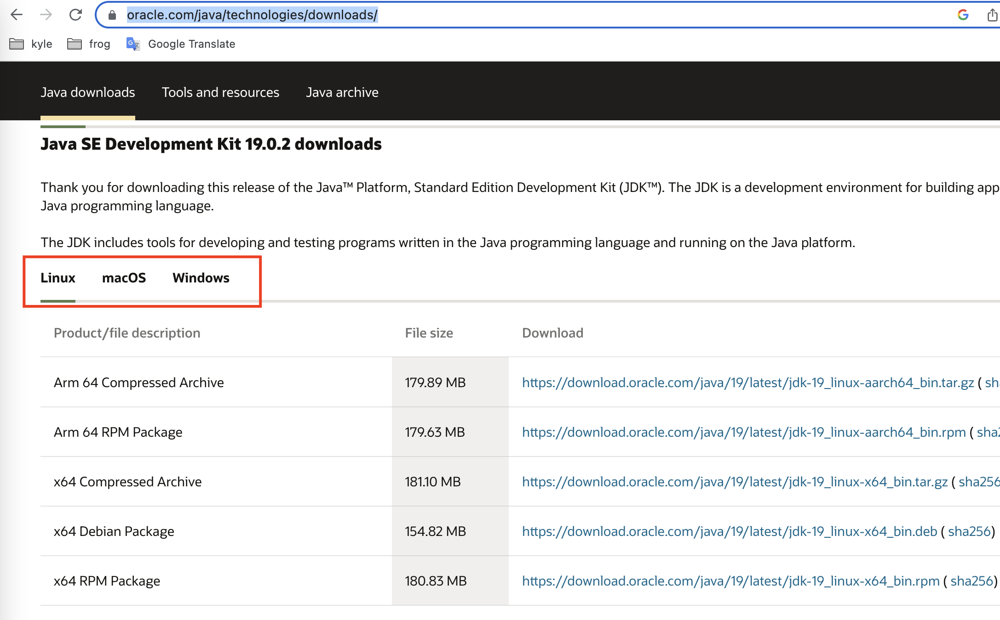

                                下载后解压到某个路径下，如
                                /opt/jdk1.8.0_281
                                
                                后将路径加入到 PATH 环境变量中，在 linux 下操作如下：
                                vi /etc/profile
                                export PATH=$PATH:/opt/jdk1.8.0_281/bin/
                                source /etc/profile

                                如果是在 windows 下请在电脑的环境变量设置中添加，如
                                /opt/jdk1.8.0_281/bin/

                                - 通过 yum 安装
                                yum -y install java

                        - maven

                                - 通过安装包安装（mac, linux, windows）
                                https://maven.apache.org/download.cgi

        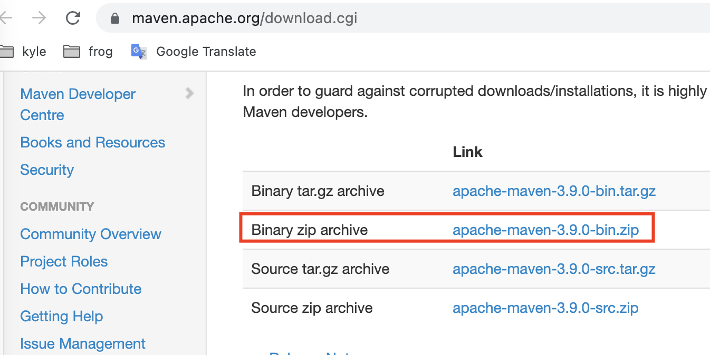

                                下载后解压到某个路径下，如
                                /opt/apache-maven-3.6.0

        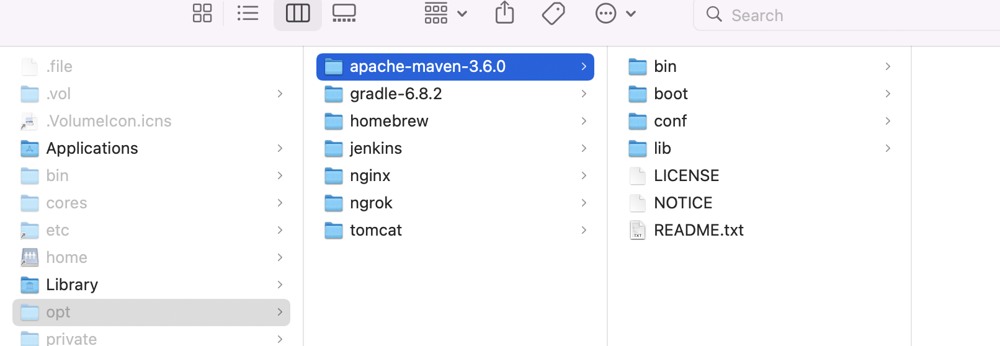

                                后将路径加入到 PATH 环境变量中，在 linux 下操作如下：
                                vi /etc/profile
                                export PATH=$PATH:/opt/apache-maven-3.6.0/bin/
                                source /etc/profile

                                如果是在 windows 下请在电脑的环境变量设置中添加，如
                                /opt/apache-maven-3.6.0/bin/

                                - 通过 yum 安装
                                yum install -y maven

                        - unzip（解压工具，可选）

        4. maven 项目

                从以上实验材料中获得 maven-example.zip
                此项目包含 log4j 等漏洞组件，也可以从 github 下载 https://github.com/kyle11235/maven-example/

        

- 开始实验

        1. 从 0 开始创建 Artifactory 仓库，配置 Xray 索引

                1.1 仓库命名规范
                        
                        e.g.
                        team1-maven-central-remote

                        team1-maven-snapshot-local
                        team1-maven-release-local

                        team1-maven-snapshot-virtual
                        team1-maven-release-virtual

                        team1-docker-dev-local

        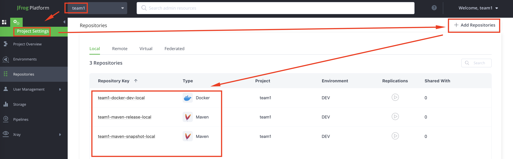

                1.2 注意为 local 和 remote 仓库开启 Xray 索引

        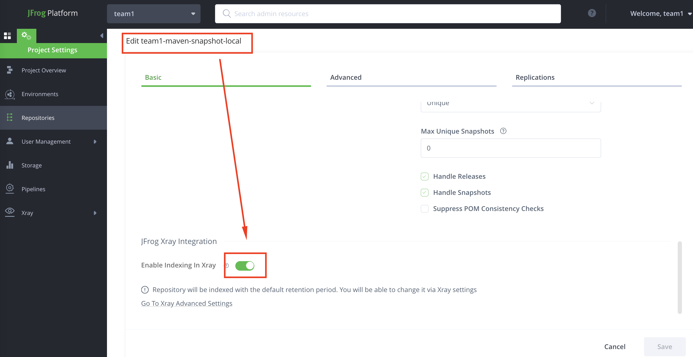

        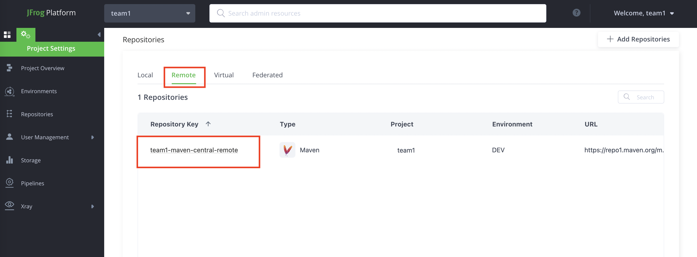

                1.3 创建 2个 maven 虚拟仓库

        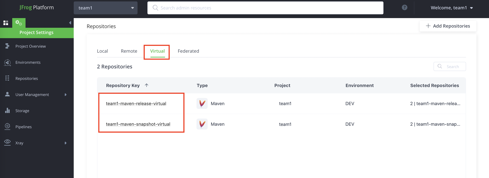

                虚拟仓库中包含 local 和 remote 类型仓库，如
                team1-maven-snapshot-virtual 包含 team1-maven-snapshot-local 和 team1-maven-central-remote
                team1-maven-release-virtual 包含 team1-maven-release-local 和 team1-maven-central-remote

        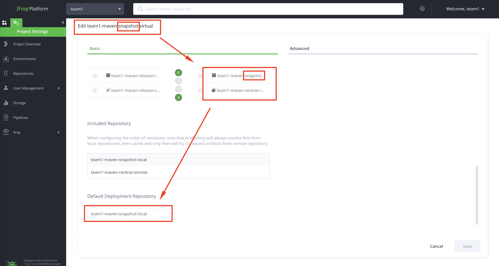

        
        2. 使用 JFrog CLI 构建 maven 项目，将构建产物上传到 Artifactory，查看 Xray 扫描出的漏洞，如 log4j

                2.1 如果你使用提供的 docker 镜像导出文件作为构建环境，先导入镜像
                
                        docker load < centos-jfrog-amd64.tar
                        docker load < centos-jfrog-arm64.tar

        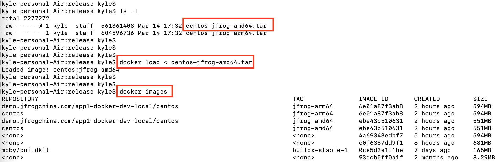

                2.2 运行
                
                        将实验材料中 maven-example.zip 拷贝到某个不包含中文、不包含空格的目录下，例如
                        /Users/kyle/Downloads/workshop

                        进入到这个目录下
                        cd /Users/kyle/Downloads/workshop

                        运行以下命令，它会挂载当前目录，使你在 docker 容器中能够访问到 maven-example.zip
                        选择适合你电脑型号的镜像，再次提醒当前路径不要包含中文、空格

                        - 此命令适合一般电脑
                        docker run -it --name centos-jfrog-amd64 -v $(pwd):/root centos:jfrog-amd64 bash
                        
                        - 此命令适合 arm 架构电脑，例如 mac m1, m2 型号
                        docker run -it --name centos-jfrog-arm64 -v $(pwd):/root centos:jfrog-arm64 bash

                        启动后可以做一些检查
                        cd ~
                        ls
                        jf -v
                        java -version
                        mvn -v

        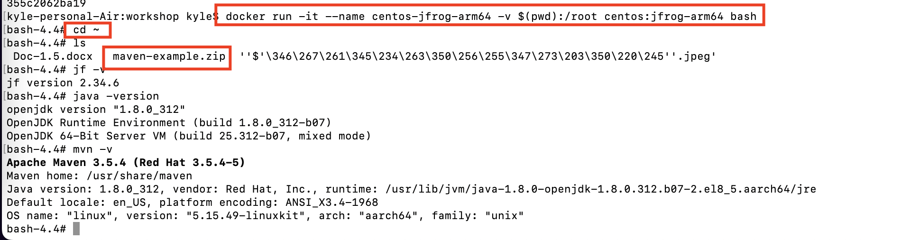

                2.3 configure jfrog cli
                
                        jf c add

                        e.g.
                        server ID = art-china (please use this ID for later maven demo)

        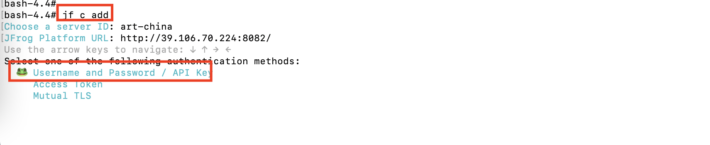

        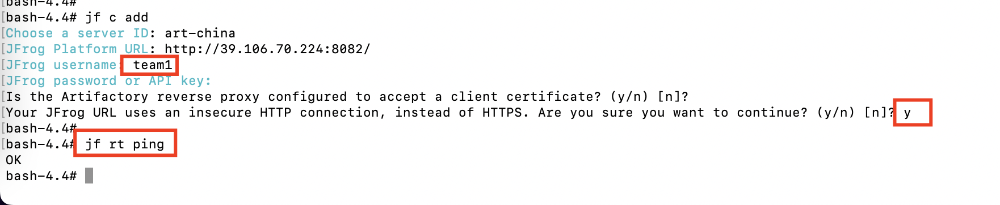

                2.4 进入 maven 项目目录
                
                        cd ~
                        unzip maven-example.zip
                        cd maven-example

                2.5 修改 maven.yaml

                        vi .jfrog/projects/maven.yaml

                        serverId: art-china 对应之前配置 jfrog cli 的 serverId
                        
                        仓库名称，请更改为你自己的, e.g.
                        team1-maven-snapshot-virtual
                        team1-maven-release-virtual

        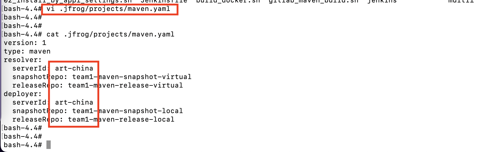

                2.6 build & deploy to artifactory
                
                        ./cli_maven_build.sh

        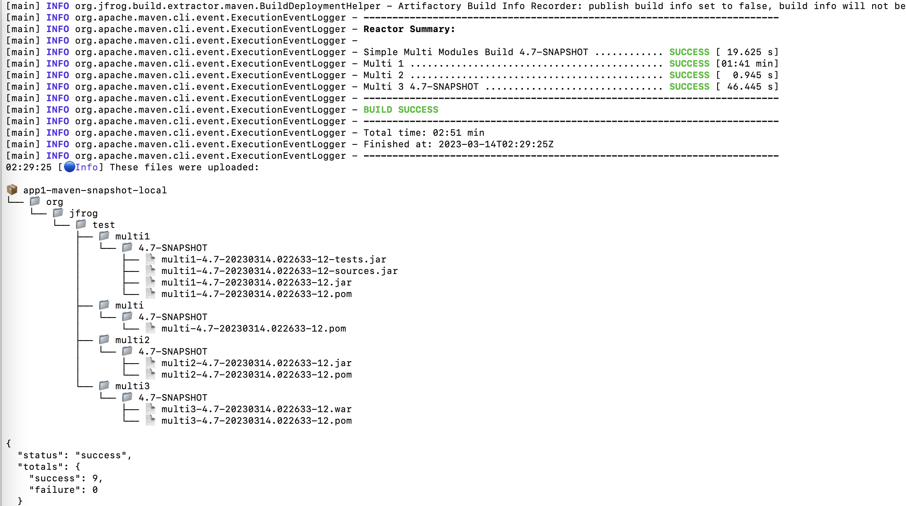

                2.7 查看上传的制品和扫描的漏洞

        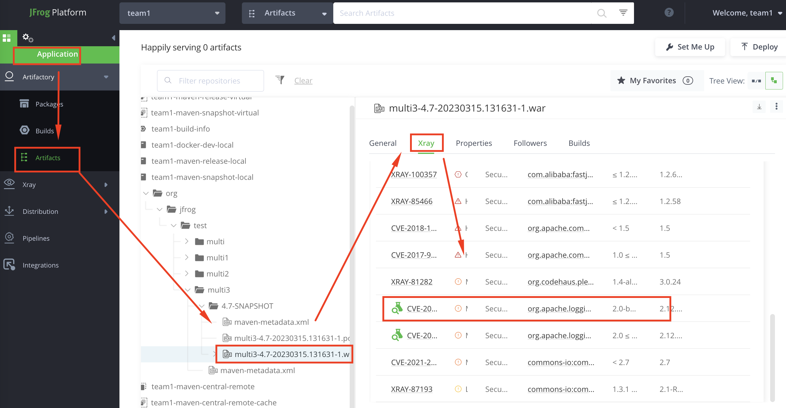

        3. 使用 JFrog CLI 对本地 war 包进行 Xray 扫描

                jf s multi3/target/multi3-4.7-SNAPSHOT.war

        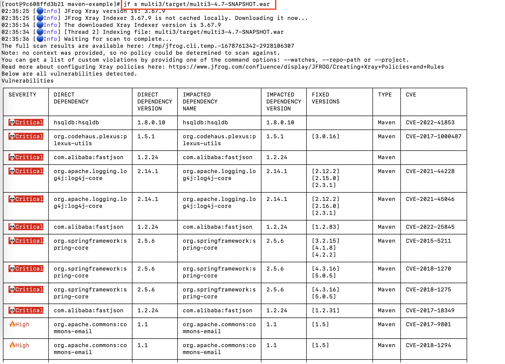

        4. 配置 Xray 的监控策略，阻止漏洞组件的下载使用

                4.1 创建 policy

        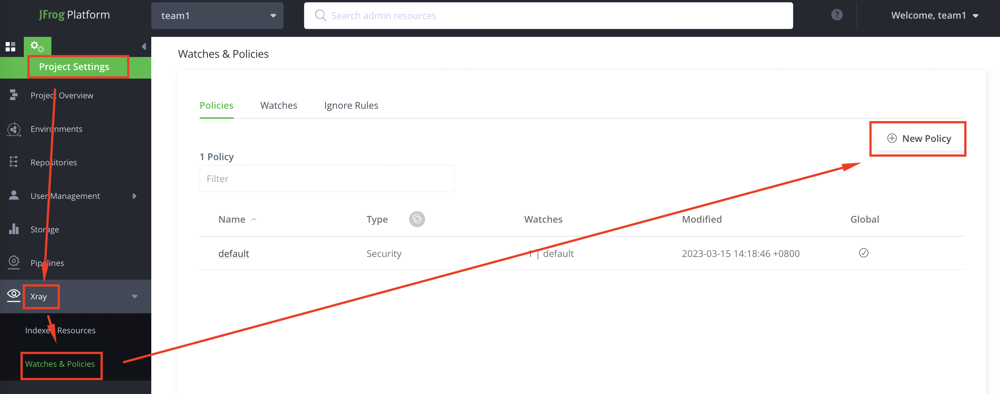

                4.2 设置 rule 的规则如果包含高危漏洞组件，则下载

        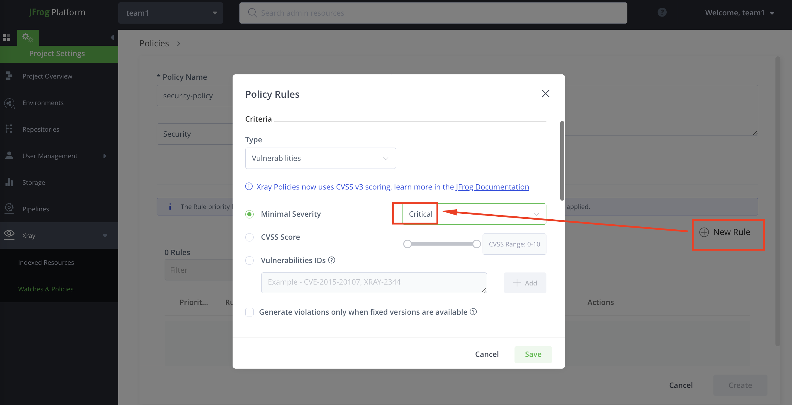

        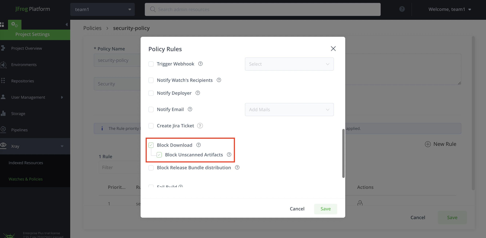

                4.3 创建 policy, rule, watch，为 watch 选中所有仓库和 rule

        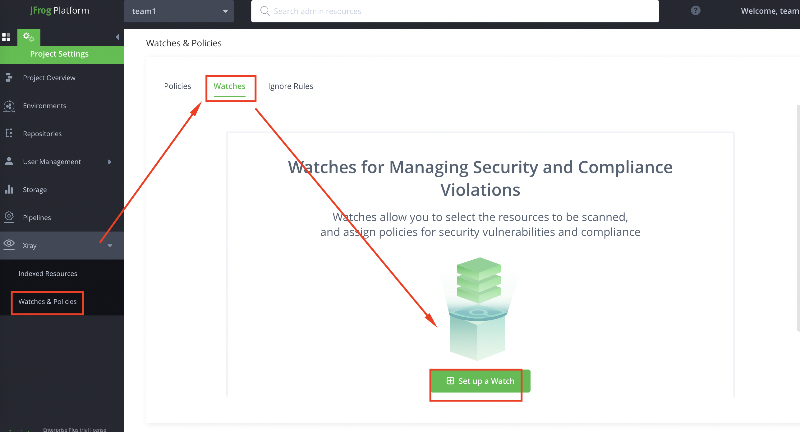

        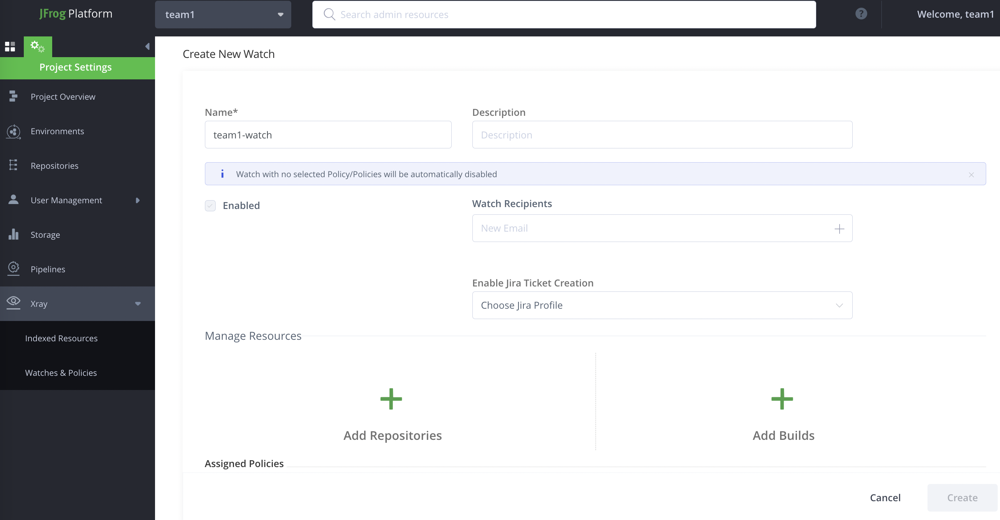

        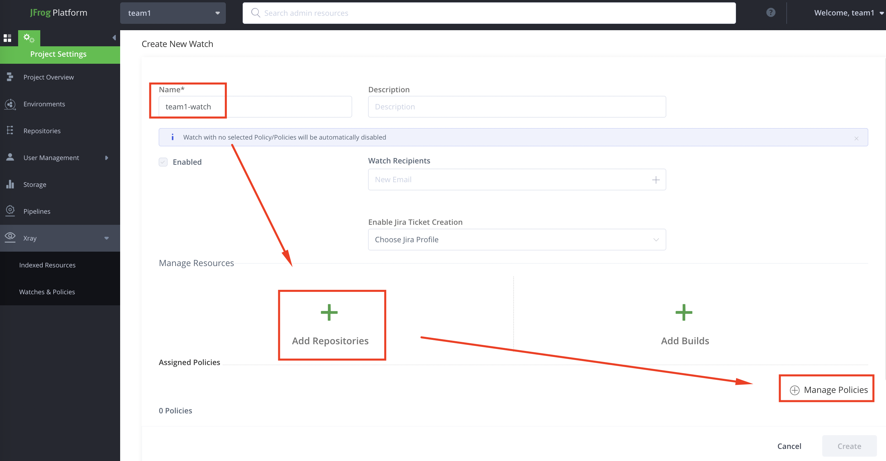

                4.4 为仓库中已有的制品点击扫描生成违反警告

        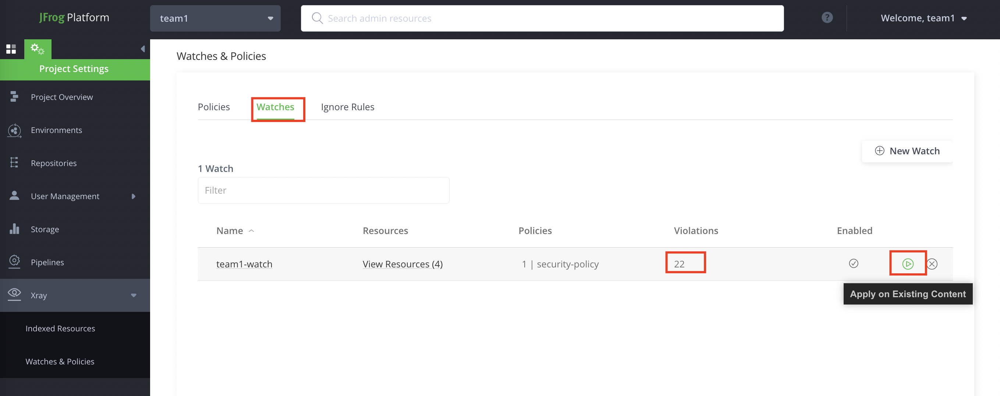

                4.5 再次查看仓库中制品，尝试下载，发现已被阻止

        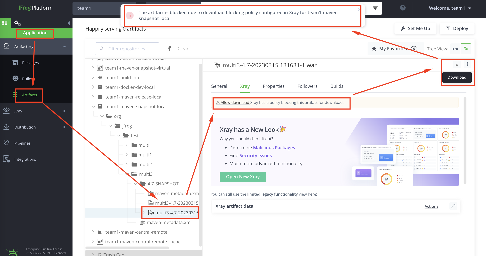

## 实验 2 - docker build & scan demo

        1. 在你的开发环境，为了访问未开启 https 的镜像仓库，做以下更改，重启 docker

                - 选择1，通过 docker desktop 页面更改后重启

        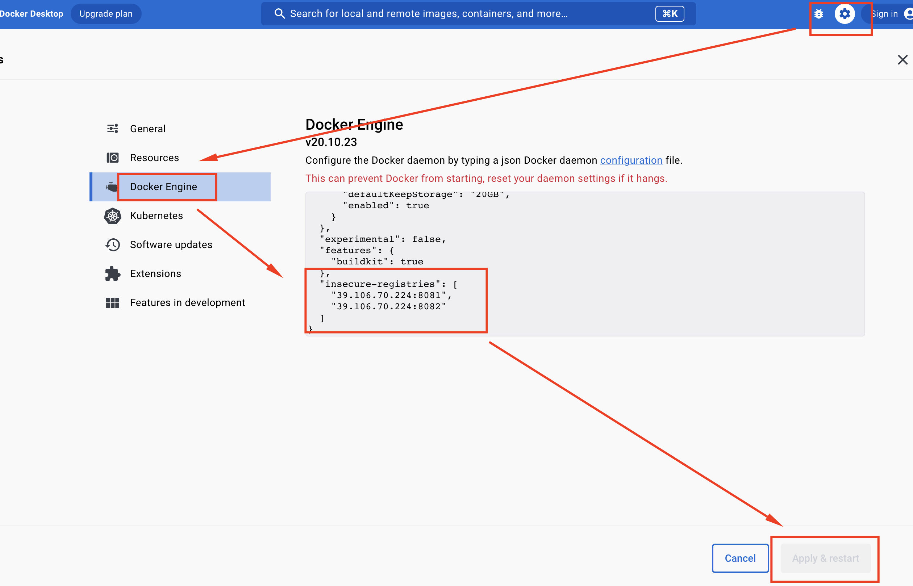

                - 选择2，也可以通过命令更改这个配置（文件位置可能由于你的操作系统而不同）
                
                        vi /etc/docker/daemon.json

                        {
                                "insecure-registries": [
                                "39.106.70.224:8081",
                                "39.106.70.224:8082"
                                ]
                        }

        2. 构建 docker 镜像
        
                完成上一个 maven 构建的实验后，从构建容器环境中退出，来到 maven-example 目录下
                
                请在以下命令中使用成你的用户名，例如 team1
                请在以下命令中使用你的仓库名，例如 team1-docker-dev-local

                2.1 构建镜像，注意 build 端口是 8082
                
                        docker build -t 39.106.70.224:8082/team1-docker-dev-local/maven-example .
                
                2.3 登录镜像仓库，注意 login 端口是 8081, 输入你的密码
                
                        docker login -u team1 39.106.70.224:8081

                2.3 登录后执行上传，注意 push 端口是 8082
                        
                        docker push 39.106.70.224:8082/team1-docker-dev-local/maven-example

        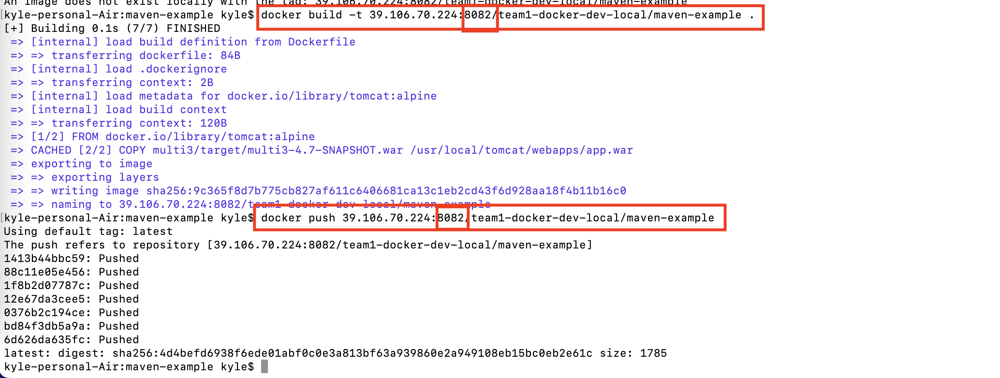

        3. 在 artifacotry docker 镜像仓库中查看被上传的镜像

                你的 docker 仓库名称为 team1-docker-dev-local 等

        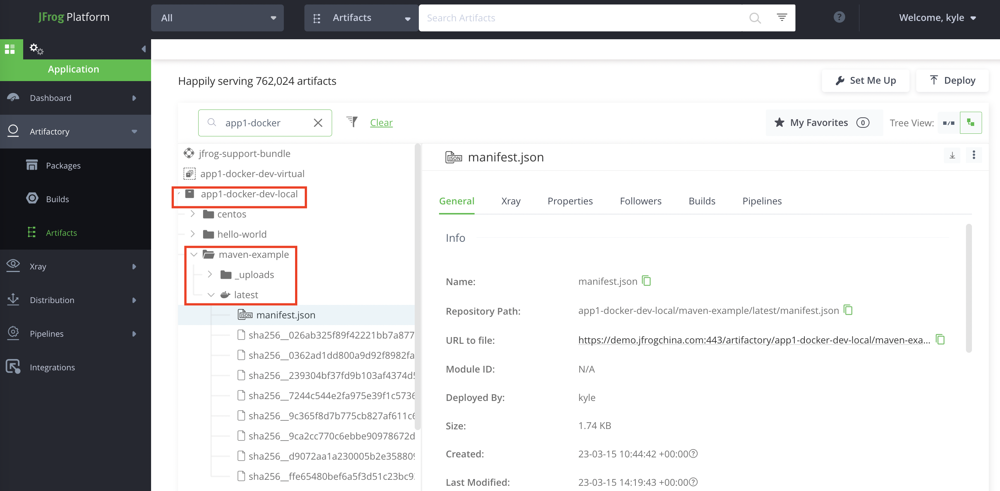

        4. 对于 docker 镜像，Xray 可对其进行深度扫描，并让你知道漏洞所在的具体层级

        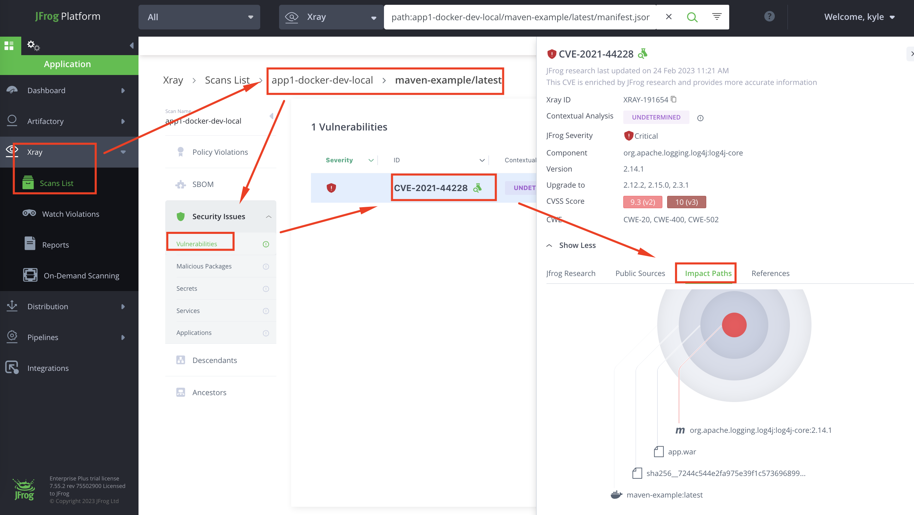

        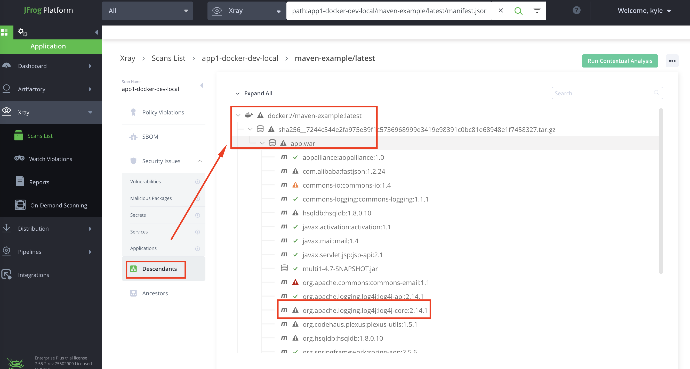

