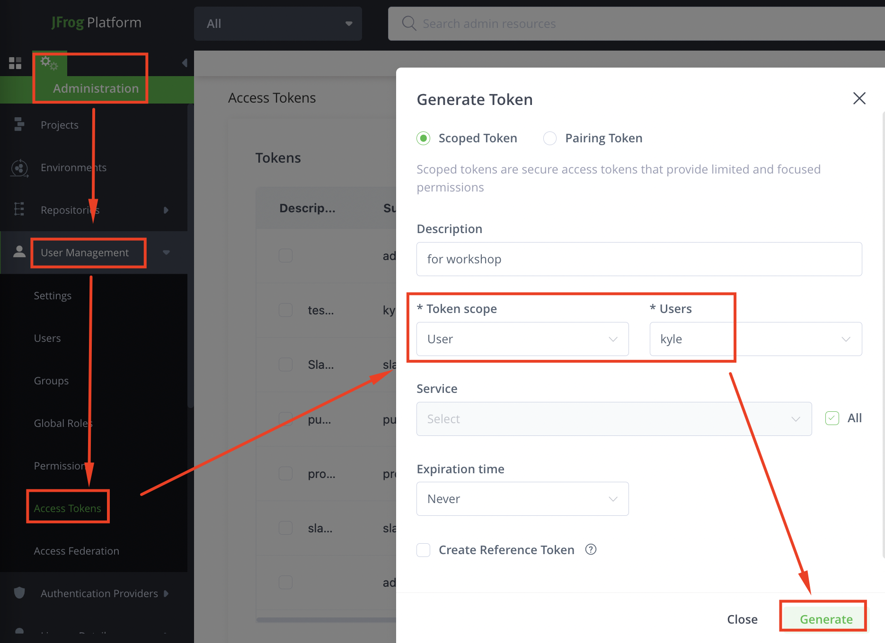
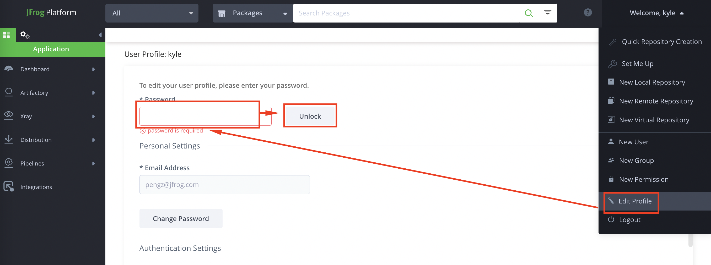
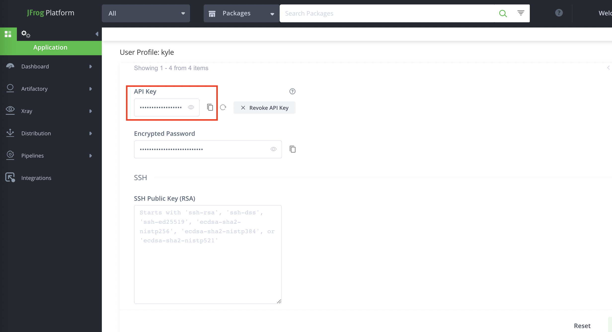
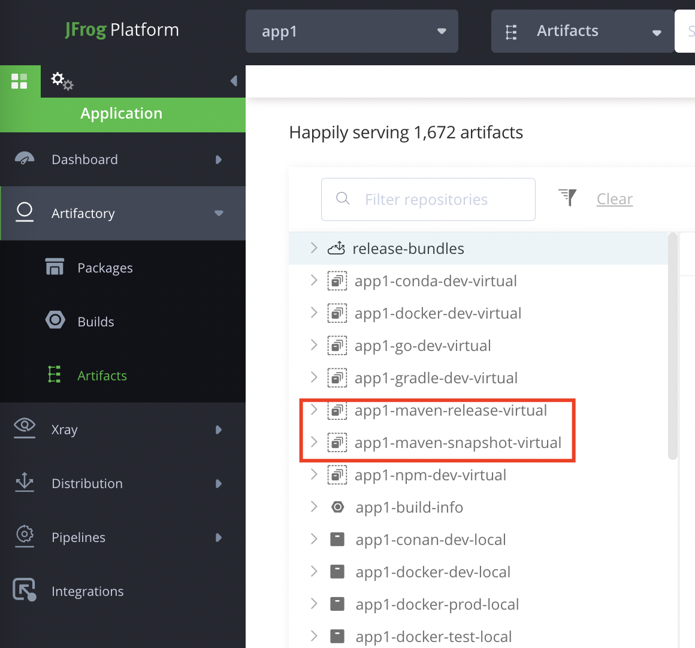
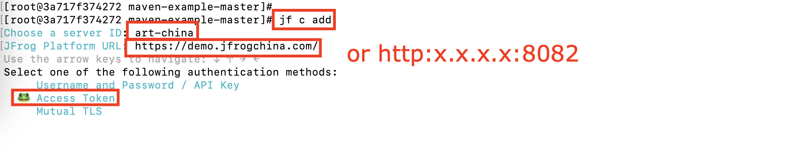
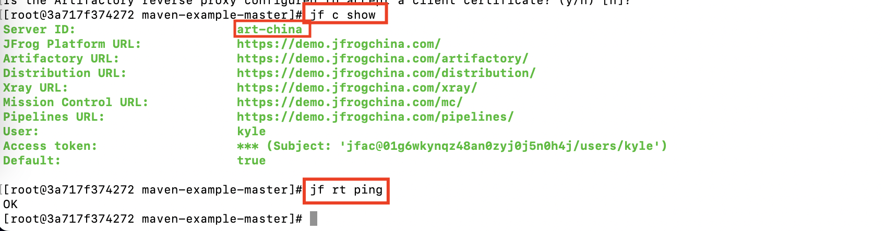
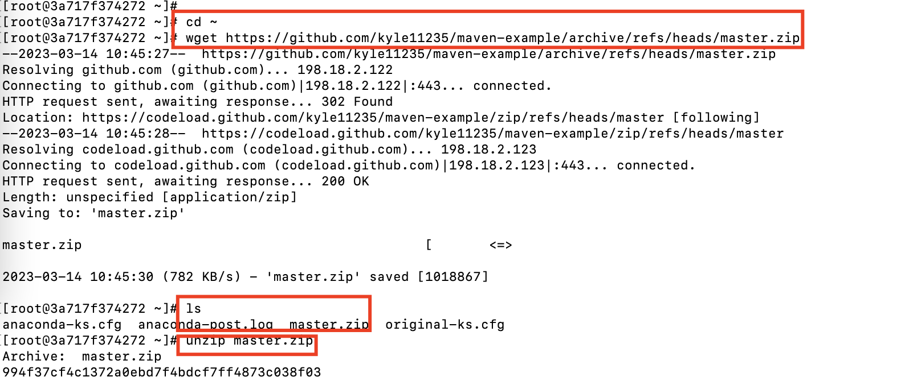

# docker image for workshop

## desc

        based on centos:centos8, below tools are installed:
        
        - jfrog cli
        - java
        - maven
        - wget
        - unzip

## buid image

        - by Dockerfile

                ./build.sh

        - by commit (optional)

                1. base image

                        docker pull centos:centos8
                        docker run -it --name centos-jfrog-arm64 centos:centos8 bash

                2. install jfrog cli

                        curl -fL https://install-cli.jfrog.io | sh
                        jf c add
                        jf rt ping

                3. install jdk

                        cd /etc/yum.repos.d/
                        sed -i 's/mirrorlist/#mirrorlist/g' /etc/yum.repos.d/CentOS-*
                        sed -i 's|#baseurl=http://mirror.centos.org|baseurl=http://vault.centos.org|g' /etc/yum.repos.d/CentOS-*
                        yum -y install java
                        java -version

                4. install maven

                        yum install -y maven

                5. install others

                        yum install -y wget
                        yum install -y unzip

                6. commit docker & save image

                        docker commit centos-jfrog-arm64 centos:jfrog-arm64
                        docker save -o centos-jfrog-arm64.tar centos:jfrog-arm64

## prepare

        - jfrog artifactory access info

                e.g.
                jfrog artifactory URL = http://x.x.x.x:8082
                username/password = admin/xxxxxx
                access token = xxx.xxx.xxx

                api key = xxxxxx

        - repositories created

                e.g.
                app1-maven-snapshot-virtual
                app1-maven-release-virtual

## run & configure

        1. pull / load image

                # docker login -u kyle demo.jfrogchina.com
                docker pull demo.jfrogchina.com/app1-docker-dev-local/centos:jfrog-amd64
                docker pull demo.jfrogchina.com/app1-docker-dev-local/centos:jfrog-arm64

                docker load < centos-jfrog-amd64.tar
                docker load < centos-jfrog-arm64.tar

        2. run
        
                docker run -it --name centos-jfrog-arm64 centos:jfrog-amd64 bash
                docker run -it --name centos-jfrog-arm64 centos:jfrog-arm64 bash

        3. configure jfrog cli
        
                jf c add

                e.g.
                server ID = art-china (please use this ID for later maven demo)
                access token = xxx

        4. test
        
                jf c show
                jf rt ping

## maven demo

        1. preprare source code
        
                cd ~
                wget https://github.com/kyle11235/maven-example/archive/refs/heads/master.zip
                unzip master.zip
                cd maven-example-master

                maven.yaml configured in this project for jfrog cli to work
                the serverId: art-china is already configured in jfrog cli in previous steps

        2. build & deploy to artifactory
        
                ./cli_maven_build.sh

        3. xray scan
        
                jf s multi3/target/multi3-4.7-SNAPSHOT.war

